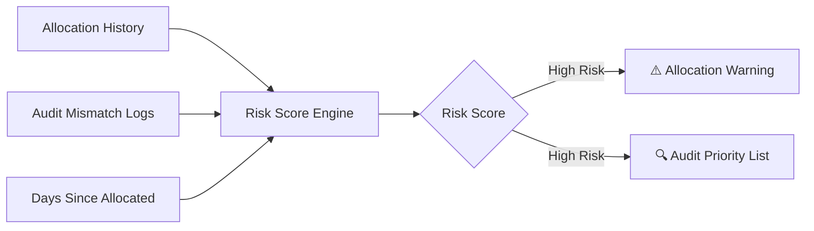

## ManageX

### A "real ERP"-style Asset Management System — built lean, built smart.

</div>

---

## 📖 Table of Contents

- [Problem Statement](#-problem-statement)
- [The Big Idea](#-the-big-idea-asset-risk-intelligence)
- [Where It Surfaces](#-where-it-surfaces-zero-new-screens)
- [Bonus Feature](#-bonus-smart-slot-suggestion)
- [Modules & Screens](#️-modules--screens)
- [Tech Stack](#️-tech-stack)
- [Risk Score Engine](#-risk-score-engine)
- [Build Roadmap](#-build-roadmap)
- [Team](#-team)
- [Why This Wins](#-why-this-stands-out)

---

## 🎯 Problem Statement

> Most asset-tracking tools are glorified spreadsheets. They *record* allocations, returns, and audits — but never *use* that data to help anyone make a better decision.

**AssetFlow** tracks the full lifecycle of organizational assets — allocation → usage → return → audit — and adds a thin intelligence layer on top of data it's *already* collecting. The result: a system that quietly thinks ahead instead of just storing records.

---

## 💡 The Big Idea: Asset Risk Intelligence

<div align="center">



</div>

No new tables. No new routes. No new screens.
Just **one utility function** that reads existing data and outputs a score.

| Signal | What It Tells Us |
|:--|:--|
| 🔁 Employee's past overdue-return count | Behavioral risk |
| 🛠️ Asset's audit-mismatch history (Missing / Damaged) | Asset reliability risk |
| ⏳ Days allocated without return | Current exposure |

Statistical + weighted → **fast, explainable, demo-safe.** No ML, no regression, no LLM calls required.

---

## 🖥️ Where It Surfaces (Zero New Screens)

<table>
<tr>
<td width="50%" valign="top">

### 1️⃣ Allocation Screen
When assigning an asset to a high-risk employee:

> ⚠️ **"This employee already has 2 assets overdue."**

A soft, non-blocking warning nudges better decisions at the point of action.

</td>
<td width="50%" valign="top">

### 2️⃣ Audit Screen
When an audit cycle starts, risky assets auto-sort to the top:

> 🔍 **"Check these first — historically flagged."**

Turns a flat checklist into a smart, prioritized to-do list.

</td>
</tr>
</table>

<details>
<summary>💬 <b>Why this matters for judging</b> (click to expand)</summary>

<br>

This is the single differentiator that separates AssetFlow from a typical CRUD-based tracker like TransitOps. It shows:
- Systems thinking, not just form-building
- Reuse of existing data instead of scope bloat
- A "predictive/preventive" layer — the kind of feature real enterprise ERPs are judged on

</details>

---

## 🎁 Bonus: Smart Slot Suggestion

*(Optional — only if time permits)*

On **Resource Booking**, if a slot is rejected due to overlap:

> ❌ 9:30–10:30 unavailable → ✅ **"Try 10:00–11:00 instead."**

A small function layered on the existing overlap-check logic — but delivers an instant **"wow"** in live demos.

> ⚠️ **Scope discipline:** One sharp feature beats three half-baked ones. This stays optional.

---

## 🗂️ Modules & Screens

> _Update this list to match your actual 10 screens_

- 📋 Asset Inventory
- 👤 Employee Directory
- 📤 Asset Allocation
- 📥 Asset Return
- 🔍 Audit Cycle
- 📅 Resource Booking
- 📊 Dashboard / Reports

---

## ⚙️ Tech Stack

> _Fill in your actual stack_

| Layer | Technology |
|:--|:--|
| Frontend | `TBD` |
| Backend | `TBD` |
| Database | `TBD` |
| Auth | `TBD` |
| Hosting | `TBD` |

---

## 🧮 Risk Score Engine

```text
RiskScore = w1 × (employee_overdue_count)
          + w2 × (asset_audit_mismatch_count)
          + w3 × (days_since_allocated_without_return)
```

- Weights (`w1`, `w2`, `w3`) are tunable constants — **no training required**
- Computed on-demand (or cached) straight from existing allocation, return & audit tables
- Lives as **one reusable utility function**, called from two UI touchpoints

<details>
<summary>🧑‍💻 Example pseudocode (click to expand)</summary>

```js
function calculateRiskScore({ overdueCount, mismatchCount, daysAllocated }) {
  const W1 = 3;   // employee behavior weight
  const W2 = 2.5; // asset reliability weight
  const W3 = 0.2; // exposure weight (scales with days)

  const score = (W1 * overdueCount)
              + (W2 * mismatchCount)
              + (W3 * daysAllocated);

  return {
    score,
    level: score >= 8 ? "HIGH" : score >= 4 ? "MEDIUM" : "LOW"
  };
}
```

</details>

---

## 🚀 Build Roadmap

- [ ] **Step 1** — Core CRUD: Assets, Employees, Allocation, Return
- [ ] **Step 2** — Audit module (basic Missing/Damaged flagging)
- [ ] **Step 3** — Risk Score utility function (plug into existing data)
- [ ] **Step 4** — Surface risk score → Allocation screen warning
- [ ] **Step 5** — Surface risk score → Audit screen priority sort
- [ ] **Step 6** *(optional)* — Smart slot suggestion on Resource Booking
- [ ] **Step 7** — Polish: Dashboard, UI cleanup, demo rehearsal

<div align="center">

`Step 1 ▓▓▓▓▓▓▓▓▓▓ → Step 7` — designed to safely fit an 8-hour build window

</div>

---

## 👥 Team

<div align="center">

| | |
|:--:|:--:|
| 🧑‍💻 **Adiba** | 🧑‍💻 **Amrita** |

</div>

---

## 🏆 Why This Stands Out

> AssetFlow doesn't add complexity for the sake of looking impressive.

It takes data the system is **already collecting** and extracts one small, genuinely useful intelligence layer from it — proving to judges the system *thinks ahead*, not just stores records.

<div align="center">

**Not just CRUD. Not just tracking. Predictive by design.**

</div>
